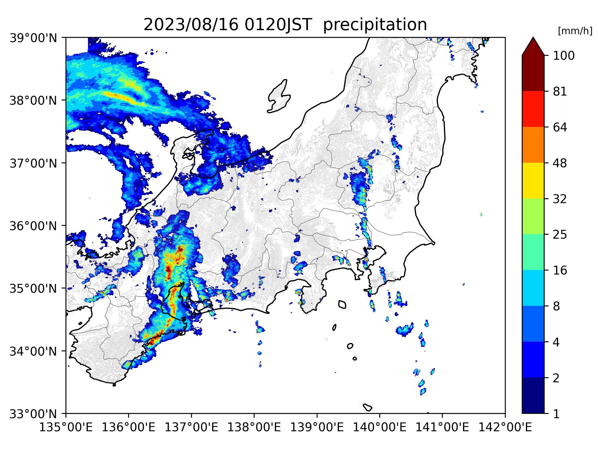

# Synthetic Radar
10分毎の雨雲レーダーエコー図を作成します。




# 仮想環境のactivate
```
python -m venv .venv
```

```
#Unix
source .venv/bin/activate
#Windows
source .venv/Scripts/activate
```

# Installation
パッケージのインストール
```
pip install -r requirements.txt
```


# Usage
`src/configuration.py`で描画範囲等を設定したのち、
```
python src/main.py
```
を実行して、画像やGifを作成します。<br>
作成された画像は `img`下に出力されます。
 
# Features
- ### 機能
   任意の日時および範囲の雨雲レーダー図を作成することができます。また、オプションで1日毎のgifやmp4を作成することができ、降雨域の時間発展をみることができます。また、標高を表示することで、より詳細な雨雲の様子を捉えられます。
   
- ### 使用データ
   雨雲レーダーのデータは、気象庁1kmメッシュ全国合成レーダーエコー強度GPVのデータを用いています。[詳細な仕様はこちら](https://www.jmbsc.or.jp/jp/online/file/f-online30100.html)<br>

 
 
# Note
図の詳細な設定を変更したい場合は `src/constant.py`の値を変更してください。
<br> 
<br>

# License
標高地図は国土地理院の提供する数値標高データより作成しています。(https://www.gsi.go.jp/kankyochiri/Laser_demimage.html)